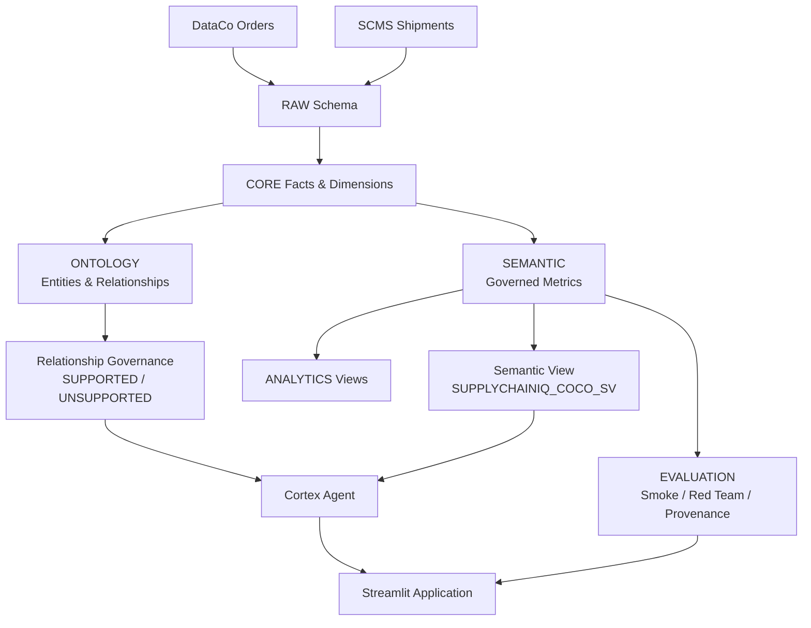

# SupplyChainIQ

SupplyChainIQ is a Snowflake-native governed supply-chain intelligence platform. It combines two independent supply-chain data sources, an explicit entity ontology with relationship governance, canonical metric definitions in a semantic layer, and a Cortex Agent that answers business questions while enforcing source boundaries, metric provenance, and deliberate refusal of unsupported relationships and non-computable metrics.

Built for the **Snowflake CoCo CLI Hackathon -- GCC Edition**.

Challenge: *Supply Chain Ontology and Governed Conversational Analytics*

## Problem

Supply-chain data is distributed across commercial, shipment, supplier, logistics, and related domains. Different teams can calculate the same business metric differently -- on-time delivery measured against all orders versus non-cancelled orders, for example, produces materially different numbers from the same data.

SupplyChainIQ addresses this through:

- A supply-chain ontology with explicit entity relationships
- Relationship governance that blocks unsupported cross-source joins
- Governed semantic views with canonical metric definitions
- A Cortex Agent that attributes every answer to its source system
- Deliberate refusal of non-computable metrics rather than silent approximation
- Provenance, trust, and red-team evaluation layers

## Solution

### Two-Island Architecture

The platform serves two independent source systems with no row-level join key between them:

| Source | Domain | Grain | Period | Records |
|--------|--------|-------|--------|---------|
| **DataCo** | E-commerce orders | ORDER_ITEM_ID | 2015--2018 | 180,519 line items |
| **SCMS** | Pharmaceutical shipments | SHIPMENT_ID | 2006--2015 | 10,324 shipment lines |

Cross-source comparison is performed only at country-aggregate level through GEOGRAPHY_DIM (165 countries, 42 appearing in both systems). Row-level DataCo-to-SCMS joins are explicitly blocked by the ontology governance layer.

### End-to-End Flow

1. **RAW** -- Source-faithful staging tables for DataCo and SCMS
2. **CORE** -- Conformed facts and dimensions (order items, shipments, customers, products, suppliers, manufacturing sites, geography)
3. **ONTOLOGY** -- Entity catalog, entity relationships, and relationship governance with explicit SUPPORTED/UNSUPPORTED status
4. **SEMANTIC** -- Governed metric definitions, enterprise scorecards, country/supplier/site scorecards, trend views, data quality scorecard
5. **ANALYTICS** -- Operational views (product performance, shipping mode analysis, top customers)
6. **EVALUATION** -- Smoke tests, red-team results, provenance tests, OTD variant registry, metric readiness assessments
7. **Cortex Agent** -- Conversational interface backed by the semantic view, enforcing governed metric formulas and source attribution
8. **Streamlit Application** -- Nine-tab decision interface deployed to Streamlit-in-Snowflake

## Architecture



## Ontology and Governance

### Entity Catalog (9 entities)

| Entity | Source | Grain | Core Table |
|--------|--------|-------|------------|
| ORDER_ITEM | DataCo | Order line item | CORE.ORDER_ITEM_FACT |
| ORDER | DataCo | Customer order | CORE.ORDER_ITEM_FACT |
| CUSTOMER | DataCo | Customer | CORE.CUSTOMER_DIM |
| PRODUCT | DataCo | Product card | CORE.PRODUCT_DIM |
| SHIPMENT | SCMS | Shipment line | CORE.SCMS_SHIPMENT_FACT |
| LOGISTICS | SCMS | Shipment cost attributes | CORE.SCMS_SHIPMENT_FACT |
| SUPPLIER | SCMS | Vendor | CORE.SUPPLIER_DIM |
| MANUFACTURING_SITE | SCMS | Manufacturing facility | CORE.MANUFACTURING_SITE_DIM |
| GEOGRAPHY | Both | Country | CORE.GEOGRAPHY_DIM |

### Relationship Governance (12 relationships)

**9 SUPPORTED** -- within-source joins with verified keys (CUSTOMER-PLACES-ORDER, ORDER-CONTAINS-ORDER_ITEM, PRODUCT-APPEARS_IN-ORDER_ITEM, SUPPLIER-PROVIDES-SHIPMENT, MANUFACTURING_SITE-PRODUCES_FOR-SHIPMENT, ORDER-LOCATED_IN-GEOGRAPHY, SHIPMENT-DESTINED_FOR-GEOGRAPHY, SHIPMENT-HAS_LOGISTICS-LOGISTICS, ORDER_ITEM-HAS_DELIVERY-ORDER_ITEM)

**3 UNSUPPORTED** -- cross-source joins deliberately blocked:

| Relationship | Reason |
|---|---|
| ORDER-LINKED_TO-SHIPMENT | No row-level cross-source key exists |
| PRODUCT-SHIPPED_AS-SHIPMENT | DataCo products are consumer goods; SCMS items are pharmaceuticals |
| SUPPLIER-SUPPLIES-ORDER | SCMS vendors do not appear in DataCo data |

## Governed Metrics

### Certified (8 metrics)

| Metric ID | Name | Source | Grain | Definition |
|-----------|------|--------|-------|------------|
| OTD_PCT | On-Time Delivery % | DataCo | ORDER_ITEM | Non-cancelled items delivered on time or in advance |
| DELAY_RATE_PCT | Delay Rate % | DataCo | ORDER_ITEM | Non-cancelled items with late delivery |
| AVG_DELAY_DAYS | Avg Delivery Delay | DataCo | ORDER_ITEM | Average excess shipping days for late items |
| TOTAL_SALES | Total Sales | DataCo | ORDER_ITEM | Sum of order item sales revenue |
| TOTAL_PROFIT | Total Profit | DataCo | ORDER_ITEM | Sum of order profit per order item |
| PROFIT_MARGIN_PCT | Profit Margin % | DataCo | ORDER_ITEM | Profit as percentage of sales |
| TOTAL_FREIGHT | Total Freight Cost | SCMS | SHIPMENT | Sum of freight cost in USD (excludes nulls) |
| LOGISTICS_RATE_PCT | Logistics Cost Rate % | SCMS | SHIPMENT | Freight cost as percentage of shipment value |

### Not Computable (6 metrics)

| Metric | Reason |
|--------|--------|
| Fill Rate | No distinct delivered/fulfilled quantity column exists |
| Days of Inventory | No inventory position or stock-on-hand data in either source |
| Inventory Turnover | Requires COGS and average inventory value; neither available |
| Perfect Order Rate | Only on-time dimension available; completeness, damage, documentation not tracked |
| Return Rate | No return event data in either source system |
| Landed Cost | SCMS freight 39.97% null, no duties/tariffs/customs fees |

## Current Governed Results

Values from ENTERPRISE_DELIVERY_SCORECARD and ENTERPRISE_LOGISTICS_SCORECARD:

| Metric | Value | Source |
|--------|-------|--------|
| On-Time Delivery % | 42.71% | DataCo (172,765 non-cancelled items) |
| Delay Rate % | 57.29% | DataCo |
| Avg Delivery Delay | 1.62 days | DataCo |
| Total Sales | $36,784,735 | DataCo (180,519 order items) |
| Total Profit | $3,966,903 | DataCo |
| Profit Margin % | 10.78% | DataCo |
| Total Freight Cost | $68,817,849 | SCMS (10,324 shipments) |
| Logistics Cost Rate | 4.23% | SCMS (39.97% null freight rows excluded) |

## Conversational Analytics

The Cortex Agent (`SUPPLYCHAINIQ_COCO_AGENT`) uses `cortex_analyst_text_to_sql` backed by the `SUPPLYCHAINIQ_COCO_SV` semantic view. Agent behavior is constrained by explicit instructions:

- Use governed metric formulas exactly as defined
- Never join ORDER_ITEM_FACT to SCMS_SHIPMENT_FACT at row level
- Attribute every answer to its source system (DataCo or SCMS)
- Decline non-computable metrics with an explanation
- Never silently exclude outliers (Belize ~311% logistics rate is real data)
- Cross-source comparison only at country-aggregate level via GEOGRAPHY_DIM

## Trust and Evaluation

### Executable Test Suite (76 test case-runs)

| Suite | Count | Latest Result |
|-------|-------|---------------|
| Smoke / Regression | 50 | 50/50 PASS |
| Red Team | 16 case-runs across 3 runs | 16/16 PASS |
| Provenance | 10 | 10 resolution test definitions |

### Governance Registry (19 entries, not executable tests)

| Registry | Count |
|----------|-------|
| OTD Variant Registry | 5 (1 governed, 4 alternative definitions) |
| Metric Readiness | 14 (8 certified, 6 not computable) |

### Red Team Purpose

The red-team suite tests adversarial questions against the Agent: unsupported relationship requests, non-computable metric requests, cross-source join attempts, and definition consistency. Red-team tests provide executable evidence of expected governance behavior but are not a mathematical guarantee that every future natural-language query will produce the governed answer.

### OTD Variants

The OTD Variant Registry documents five ways to calculate on-time delivery from the same data. Only `OTD_V1_GOVERNED` (non-cancelled items, advance or on-time = success) is the governed definition. The four alternatives produce different numbers and are registered to explain legitimate disagreement between teams.

## Streamlit Application

Nine-tab decision interface deployed to Streamlit-in-Snowflake:

| Tab | Purpose |
|-----|---------|
| **Analyst** | Governed conversational AI with Enter-to-submit, provenance, refusal behavior |
| **Trust** | OTD variant disagreement analysis, persona consistency, metric readiness, red team |
| **Governance** | Metric registry, relationship governance, ontology graph, readiness matrix, OTD variants |
| **Control Tower** | Executive KPIs, delivery and commercial charts, data quality |
| **Decision Signals** | Ranked supply-chain exceptions ordered by severity |
| **Country Intel** | Cross-source quadrant analysis, risk tiers, coverage |
| **Supplier / Site** | Concentration analysis, cost-rate rankings with volume thresholds |
| **Trends** | Monthly delivery, commercial, and logistics time series |
| **Evaluation & Trust Contract** | Smoke tests, provenance tests, test health (sub-tabs: Overview, Smoke Tests, Provenance, Details) |

## Repository Structure

```
agent/              Cortex Agent DDL and instruction specification
analytics/          Operational analytics views (product, shipping, customers)
core/               Conformed facts and dimensions
docs/               UI guardrails and development constraints
evaluation/         Smoke tests, red team, provenance, readiness, OTD variants
ontology/           Entity catalog, relationships, relationship governance
raw/                Source-faithful staging DDL for DataCo and SCMS
semantic/           Governed metric registry, scorecards, semantic view YAML
streamlit/          Streamlit application (app.py, provenance, disagreement, readiness)
```

## How It Works

1. Source data is loaded into governed RAW tables preserving source-island separation
2. CORE facts and dimensions establish consistent business entities with normalized country names
3. ONTOLOGY defines 9 entities and 12 relationships with explicit SUPPORTED/UNSUPPORTED governance
4. SEMANTIC views define 8 canonical governed metrics with SQL expressions and grain documentation
5. ANALYTICS views expose operational rankings (products, customers, shipping modes)
6. The Cortex Agent answers natural-language questions using the semantic view, enforcing metric formulas and source attribution
7. EVALUATION layers validate behavior: 50 smoke tests, 16 red-team case-runs, 10 provenance tests, plus readiness and variant registries
8. The Streamlit application presents governed intelligence across 9 decision-oriented tabs

## Key Design Decisions

- **Snowflake-native**: All objects (raw through agent) live in a single Snowflake database
- **Two-island integrity**: DataCo and SCMS are never joined at row level; the architecture makes this constraint explicit rather than hoping the Agent avoids it
- **Relationship governance**: Unsupported joins are registered with reasons, not silently omitted
- **Canonical metrics**: Each governed metric has one SQL expression, one source system, one grain
- **Explicit non-computability**: Six standard supply-chain KPIs are documented as not computable with specific blocking reasons rather than approximated
- **Outlier inclusion**: Anomalous data (e.g., Belize 311% logistics rate) is reported, not silently excluded
- **Provenance**: Agent answers resolve to governed metrics with three-tier matching (SQL expression, column signature, answer text fallback)
- **Red-team validation**: Adversarial test cases verify the Agent declines unsupported requests

## Try These Questions

These three queries demonstrate the core governance behavior in the Analyst tab:

1. **"What is our enterprise on-time delivery rate?"** -- resolves to the governed OTD_PCT metric with source attribution and provenance
2. **"Can you calculate Fill Rate?"** -- returns a data readiness explanation: Fill Rate is not computable from the available data
3. **"Join DataCo orders with SCMS shipments."** -- triggers a governance boundary refusal: no row-level cross-source join key exists

## Development with Snowflake CoCo CLI

SupplyChainIQ was developed iteratively using Snowflake CoCo CLI as the development assistant. CoCo was used during the implementation and refinement of the Snowflake-native data model, ontology governance, semantic layer, Cortex Agent configuration, evaluation suite, and Streamlit application. Snowflake is the execution and data platform. The GitHub repository contains the resulting implementation and documentation.

## Prototype

The prototype is deployed as a Streamlit-in-Snowflake application using the `@SUPPLYCHAINIQ_COCO.APP.STREAMLIT_STAGE` stage. The public prototype link is provided separately through the hackathon submission.

## Limitations

- **No row-level cross-source join**: DataCo orders and SCMS shipments cannot be linked at the transaction level. Country-aggregate comparison is the only supported cross-source grain.
- **Non-computable metrics**: Fill Rate, Days of Inventory, Inventory Turnover, Perfect Order Rate, Return Rate, and Landed Cost cannot be certified from available data.
- **Freight null coverage**: SCMS freight cost is null for 39.97% of shipments. Freight-based metrics are computed from non-null rows and represent lower bounds.
- **Agent instruction adherence**: The red-team suite validates expected governance behavior, but natural-language interfaces cannot provide a mathematical guarantee that every possible query will produce the governed answer.
- **Temporal mismatch**: DataCo covers 2015--2018; SCMS covers 2006--2015. Cross-source country comparisons span different time windows.

## Why This Matters

SupplyChainIQ gives planning, procurement, logistics, and leadership teams a shared governed view of supply-chain performance. Unsupported relationships and unavailable metrics are made explicit rather than silently producing misleading answers. When two teams disagree on OTD, the platform documents both definitions and identifies which one is governed -- turning a data trust problem into a transparent, auditable decision.
